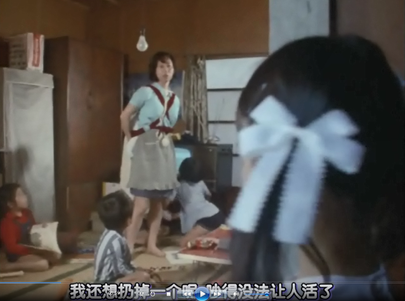
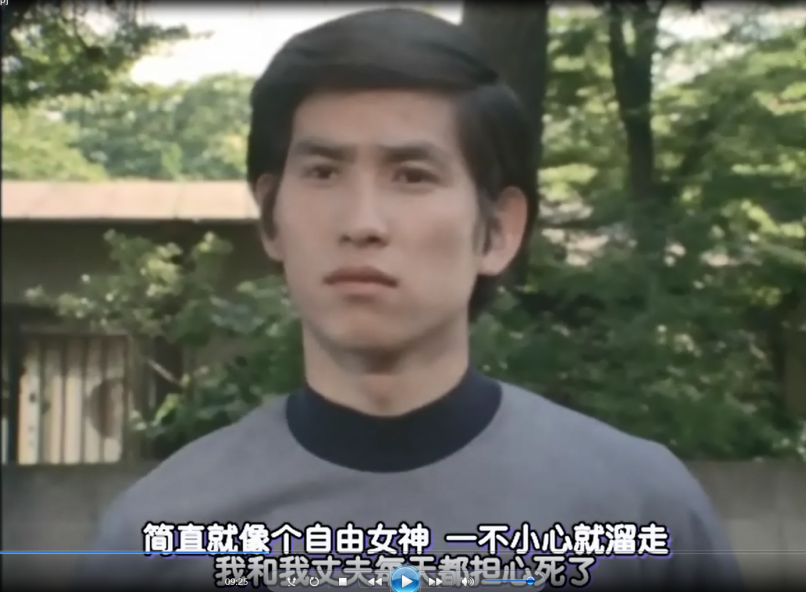

# 【昭和·泰罗TV】第十一话《吊唁花是少女在作怪》
登场怪兽：常春藤怪兽-巴色拉

## 剧情简介
舍子冢上悄悄绽放的红色花朵，以儿童为目标，黑暗中的怨恨之花。连续发生的凶杀事件的真相究竟是什么。 友田家有危险，墓地上的危机。天真烂漫的少女加奈的真正身份是什么。。。。。。

## 剧情、感想与吐槽

对于这一集，想必小时候看过的人一定会说“童年阴影”，哈哈哈，还好我小时候没看过这一集。昨天下午苦于等泰迦25集，索性补补他老爹泰罗的TV，于是就随机选了这一集，说实话一遍看我没带耳机，没有啥感觉，当我晚上记录剧情的时候，室友都睡了，寝室里黑漆漆的，加上藤蔓的婴儿啼哭声，真的把我吓的不敢去上厕所。

这一集的主题偏向于诡异深刻的风格。开局就出现了送人头的警察还有诡异的bgm，而且这已经不是第一次杀人事件了。

光太郎这段时间应该是值夜班，刚睡下就被森山的电话吵醒了。后面森山遇袭之后到ZAT队里，也只有光太郎一个人在，其他队员都回家去了，也说明光太郎这段时间在值夜班。杀人事件光太郎没有兴趣，但是听到有怪兽，光太郎立刻来了精神，或许这就是奥特曼吧。

警察对于这个案件无能为力，于是就请求ZAT队的帮助，当然ZAT队一事件也没有什么进展，谁又能想到杀人事件的元凶是“藤蔓”呢。

事情出现转机的是，光太郎遇到了小女孩。这一集的小女孩出场也自带着那诡异的bgm，这种风格的bgm我在归曼33集的《怪兽、使者与少年》感触颇深，这种类型的bgm给我的感受是这一集将不再是轻松愉快的节奏，而是深刻的内容。加奈，明明是小孩子调皮的年纪，但是却没有像其他孩子喜欢玩吵闹，加奈在全集里面也没有笑过几次，多是阴着脸、拿着花、玩弄着剪刀。

光太郎帮加奈找家的过程中，加奈带着他走到了一户人家，家里只有一个女人，却有着4、5个小孩子。女人忙不过来，还抱怨地向光太郎说她还想扔掉一个呢，减轻生活压力，由此可以看出，当时日本的社会也面临着超生的危机。

我们再回到开头，警察发生事故的场所是哪里？舍子冢，这是啥，就是被抛弃的孩子的坟墓！！！孩子被抛弃，是谁的错，生而不养枉为人父母！！！ZAT队里面，队员们也在激烈地谈论这一话题。这一集的主题已经在这里变得十分明郎，就是在批判这种抛弃孩子的行为。

当然建一的吐槽也很有意思，爸妈不在家，姐姐又去进修了，他自己一个人在家也像个孤儿一样。建一的自述代表着另一批孩子，他们虽然不是被抛弃的，但是却也不能随时见到父母，我们说的留守儿童就是这种情况。父母在外打拼，孩子留在家里和哥哥姐姐爷爷奶奶一起住，这种事情在我们中国也很常见。好在建一有着纱织姐姐、森山姐姐、光太郎哥哥在身边陪伴，不孤单，所以建一有着一个良好的心态。

我本来想不通为什么加奈要给建一吸血花，后来明白了，虽然建一也像加奈一样见不到父母，但是建一有着关心他的人，而加奈没有，所以加奈就要毁掉这种美好。

光太郎调查之后，发现原来加奈是友田家领养的孩子。光太郎将加奈送回友田家之后，加奈笑着对光太郎说再见，这应该是加奈全集中最开心的一次了。光太郎也奇怪了。

光太郎带着加奈到友田家时，但是加奈表现出来的完全不像是迷路的孩子突然找到家的喜悦。友田太太听佣人说小姐回来了，立即走了出来.

她不是不喜欢加奈，而是不会从自身找原因。她对光太郎说加奈老是乱跑，她指责佣人为什么没有管好加奈，你MD，我要说“到底是你养孩子还是佣人替你养孩子？？？”所以光太郎在友田家里也感觉很疑惑，他觉得这对于加奈来说不像是真正的快乐。

夜里，目的里又传来了婴儿的啼哭声，十分的瘆人。藤蔓伸向了建一的家里。加奈送的花，花仿佛活了，震碎了花瓶，落到了地上。藤蔓从通风口进来了！！！藤蔓连接上了落在地上的花，散发着红光的藤蔓伴随着婴儿啼哭声打开了森山的门，森山遭到了袭击。森山大叫着甩脱藤蔓，跑上了楼梯去叫醒熟睡中的建一，藤蔓破门而入。眼看森山和建一就要遭到毒手。

建一家外，路过的三个醉汉，阴差阳错地拔断了藤蔓，藤蔓瞬间失去了活力，倒在惊恐的森山和建一面前。藤蔓顶端的花中流出了鲜红的血。

森山将藤蔓带到了ZAT队，她和光太郎讨论着藤蔓和吸血鬼有没有关系。光太郎看着藤蔓上的花陷入了沉思：“等一等，这花，啊，是那孩子的花。森山君，快查友田家的电话。”（可以看出光太郎又是夜班hhhh）

光太郎拨通了友田家的电话，友田太太对光太郎还是很客气的，但是友田太太没有对光太郎说的花在意，对光太郎说太晚了要休息了，就挂断了电话。好了，死亡预定。

加奈在建一家里比友田家里快乐，友田太太虽然不是坏人，但是她不懂加奈到底需要的是什么，友田太太觉得钱能解决小孩子的所有问题，以至于说加奈晚上要去给花浇水，友田太太都不让，友田太太夺过花就扔了，还说要给加奈买更家漂亮的花。但是，这样加奈就会开心吗？显然不会，不然加奈也就不会对友田太太的死无动于衷。加奈是被领养的孩子，领养本来对孤儿来说是一件好事，被友田家这样的大富豪领养就更是一件好事，但是不懂得如何去对待孩子、去照顾孩子，那么一切就是冷冰冰的。

友田太太死后，加奈就上街把花分给过路的行人，注意了，这里的行人都是带着孩子的妈妈。为什么？因为加奈要毁掉这一切美好的事物，她得不到，别人也一样得不到。这个时候加奈已经变成了一个拿着花微笑着的恶魔，她要毁掉她没有的美好事物。

光太郎上去阻止加奈，他踩碎了花，但是加奈不怕也不生气，因为她还有好多花。后来北岛带着光太郎找到了花的源头，捣毁花藤的时候，加奈生气地大吼：“哥哥是混蛋”。

光太郎破坏了加奈的计划，加奈原先心中那个会关心人的大哥哥也并不是十分理解加奈的想法，而是一个劲的将加奈的报复工具破坏，光太郎认为这样就能使加奈醒悟，但是恰恰相反，加奈不但没有醒悟，反而更加执迷。原先在她心中善良体贴的大哥哥也没有考虑她真正像要什么，加奈觉得这个世界已经没有人关心她了。

光太郎的做法并没有什么错误，毁掉花保护社会并没有什么可以指责的地方。但是若光太郎能更加关心加奈一点，不在加奈面前直接破坏吸血花，那么对加奈来说，这样的处理方式应该会更好一点。暴力不能解决人的心理问题，只会让人的心变得更加扭曲。

光太郎和北岛的拔藤行动使得怪兽从地下钻了出来。

泰罗这集出场时，为了省经费，泰罗跃起飞踢的镜头借用了后面泰罗战胜怪兽飞走时的镜头，计时器突然从蓝色变成红色又变成蓝色，所以有一两秒的穿帮。看视频左上角的云朵也可看出来是重用了同一个画面。

好了，接下来就是这一集最令人产生联想幻觉还有思考的情节，泰罗用光线解决怪兽之后，僧侣念经的声音就响起，舍子冢上的墓碑掉落了下来，北岛也恢复意识，但是北岛又看到了怪兽的五彩灵魂实体化，怪兽在烧毁了一座寺庙一样的建筑物就又爆炸了。

我不知道这是怪兽没死透还是说只是北岛的幻觉。要是没死透，那么泰罗肯定会做出反应，但是剧中并没又给泰罗镜头。但说成是北岛的幻觉又不像，毕竟寺庙烧毁了。

我个人认为，不管到底什么导演安排这一幕，总之都有道理存在。关注点不要放在到到底是幻觉还是怪兽灵魂实体化，关注的应该是怪兽为什么只烧毁那座寺庙，而不是烧毁其他的建筑物。僧侣的念经真的能超度那些被抛弃孤儿的灵魂吗？只是念经祭奠死去的弃儿，而没有从根本上去阻止、去挽救、去解决这种问题，那么怪兽巴色拉还是会再次出现的，吸血的藤蔓和花朵还是会被加奈找到……

泰罗最后在念经声中飞走了，伴随着红色的身躯上升的还有很多红色的气球。红色气球象征着喜悦，象征着怪兽被消灭后人们的欢乐；红色气球也象征着血液，由于血液是红色，因此很多地方都把红色作为生命的象征，象征生命中的禁忌、牺牲、赎罪、仁爱与热烈。

故事的结尾，加奈离开友田家回到孤儿院，并依旧拿着剪刀走在舍子冢就说明了加奈并没有醒悟，她还在找着她的杀人工具。

人类的生命是靠血液的流动生存着的，人与人之间的亲情血浓于水，但那浓于水的血缘关系却敌不过不负责任的父母无情抛弃，生而不养岂为人哉，养而不教又何须此为！！！

